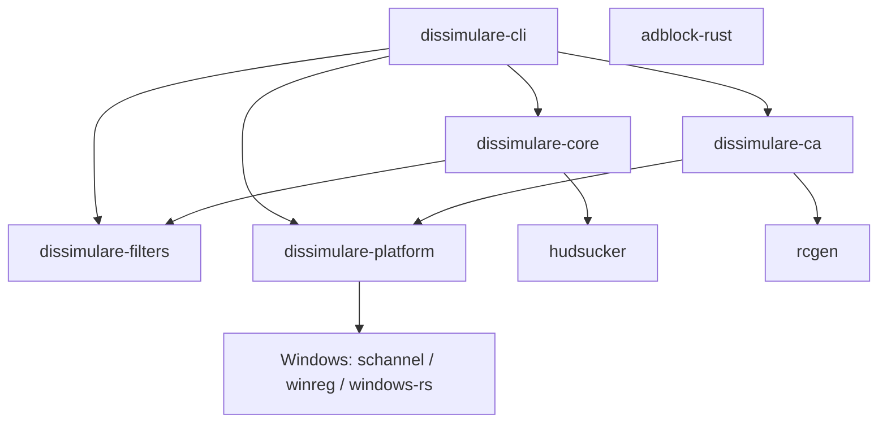

<h1 align="center">🎭 Dissimulare</h1>

<p align="center">
  A local MITM proxy that blocks ads/trackers outright — and feeds the ones it can't block deliberately absurd, ever-changing fake data instead of trying to hide.
  <br>
  Built in Rust on <code>hudsucker</code> and Brave's <code>adblock-rust</code>.
</p>

<p align="center">
  <a href="#-yes-this-is-a-mitm-proxy">Yes, this is a MITM proxy</a> ·
  <a href="#-features">Features</a> ·
  <a href="#-status">Status</a> ·
  <a href="#-installation">Installation</a> ·
  <a href="#-architecture">Architecture</a> ·
  <a href="#-building">Building</a> ·
  <a href="#-roadmap">Roadmap</a> ·
  <a href="#-license">License</a>
</p>

<p align="center">
  
  
  
  
  <a href="#-license">
    
  </a>
  <a href="https://github.com/viincnt/Dissimulare">
    
  </a>
</p>

---

Dissimulare sits between your machine and the internet, decrypts your own HTTPS traffic, blocks what's on EasyList/EasyPrivacy, strips known tracking parameters out of every URL, and rewrites the fingerprinting surface every site tries to read — not by omitting data, but by handing out a different, deliberately ridiculous hardware/OS identity to every domain that asks.

Most privacy tools try to make you look like everyone else. Dissimulare doesn't bother: it would rather a data broker's database end up with a `M1A2 Abrams Tank Fire Control System v4` running `TempleOS v5.03 Public Domain` than a real, correlatable device fingerprint.

> ### 🔓 Yes, this is a MITM proxy.
>
> Not a euphemism, not a footnote. Decrypting, inspecting, and rewriting your own HTTPS traffic is *literally the mechanism* by which this thing blocks ads and force-feeds garbage to trackers — there is no version of that feature set that doesn't require it. I'm not going to call it a "traffic optimizer" or bury it in section 4 of a privacy policy.
>
> What I *do* commit to:
> - It only ever intercepts **your own traffic, on your own machine**, because you asked it to.
> - The root CA it generates is installed **only for your current Windows user account** (`CurrentUser\Root`), never system-wide, never requiring admin elevation.
> - Nothing is installed without you typing `I AGREE` at an explicit, unskippable consent screen that says exactly what's about to happen.
> - `dissimulare uninstall` removes the CA and reverts your system proxy settings in one command — no leftover trust anchors.

---

# ✨ Features

### Blocking

- `adblock-rust` (the engine behind Brave's ad blocker) matching against EasyList + EasyPrivacy
- Filter lists are downloaded, cached on disk, and refreshed on a schedule — no re-parsing on every start
- Tracking query parameters (`utm_*`, `fbclid`, `gclid`, `msclkid`, and more) stripped from every URL, blocked or not
- Blocked requests get a resource-shaped no-op response (transparent GIF for images, empty script for scripts, `204` otherwise) instead of a hard failure, so pages don't break just because an ad didn't load

### Fingerprint chaos

- Every domain gets a different absurd hardware/OS combination — hundreds of them, spanning military hardware, spacecraft, dead operating systems, appliances, and outright fiction — picked deterministically from a per-install seed, so the same site always sees the same nonsense but no two sites see the same nonsense
- `User-Agent`, `Sec-CH-UA-Platform`, and `Sec-CH-UA-Model` headers all carry the chosen identity; the rest of the granular client hints are stripped outright
- A script is injected into every HTML response so `navigator.userAgent`/`navigator.platform` and WebGL's vendor/renderer strings agree with what was just sent over the wire — an identity that lies to the network but tells the truth to client-side JS is a bigger tell than no lie at all
- Cross-site `Referer` gets trimmed to bare origin, and `Sec-GPC: 1` is sent on every request

### Trust & control

- The root CA is generated once, persisted, and only ever trusted for the current Windows user
- First run requires explicit, typed consent before anything touches the system
- `dissimulare status` shows what's trusted and what's cached; `dissimulare uninstall` tears it all back down

---

# 🚦 Status

Dissimulare is early — the core proxy pipeline works end-to-end, but it hasn't been packaged or widely used yet.

| Crate                 | Status | Role                                                              |
| ---------------------- | :----: | ------------------------------------------------------------------ |
| `dissimulare-platform` | 🟢 | OS integration only — cert store & system proxy, Windows implemented |
| `dissimulare-ca`       | 🟢 | Root CA generation, persistence, and trust-store lifecycle          |
| `dissimulare-filters`  | 🟢 | `adblock-rust` wrapper — list fetch/cache/refresh, block decisions  |
| `dissimulare-core`     | 🟢 | The proxy pipeline itself, including chaos-mode identity + injection |
| `dissimulare-cli`      | 🟢 | `setup` / `run` / `status` / `uninstall`                            |
| GUI / system tray      | ⚪ | Not started — CLI only for now                                     |
| macOS support          | ⚪ | Planned; only `dissimulare-platform` should need new code           |

---

# 📦 Installation

There's no packaged installer yet — Microsoft Store distribution is the goal, but for now Dissimulare is built and run from source:

```sh
cargo run -p dissimulare-cli -- setup   # first run: consent screen, CA, filter lists
cargo run -p dissimulare-cli -- run     # start the proxy
```

`setup` will not touch your certificate store until you type `I AGREE` at its consent prompt. See [Building](#-building) for platform requirements.

---

# 🏗 Architecture



### Stack

| Layer                    | Technology                          |
| ------------------------- | ------------------------------------ |
| MITM / TLS interception   | `hudsucker` (hyper + rustls)         |
| Ad/tracker filtering      | `adblock-rust` (EasyList/EasyPrivacy) |
| Root CA generation        | `rcgen`                               |
| Async runtime             | `tokio`                               |
| OS trust store (Windows)  | `schannel` + `windows`                |
| System proxy (Windows)    | WinINet + registry                    |
| CLI                       | `clap`                                |

<details>
<summary><strong>Architecture details</strong></summary>

`dissimulare-platform` is the only crate allowed to contain `#[cfg(target_os = "windows")]` code, hidden behind two traits: `CertStore` (install/remove/query the root CA) and `SystemProxy` (point the OS at the proxy and back). Every Windows-specific call — Crypt32 cert-store operations via `schannel`, registry writes via `winreg`, WinINet refresh via `windows` — lives in one file. Porting to macOS means adding one new implementation of those two traits; nothing else in the workspace should need to change.

`adblock-rust`'s `Engine` uses `Rc`/`RefCell` internally and is neither `Send` nor `Sync`, which is incompatible with `hudsucker::HttpHandler`'s trait bounds. Rather than fight that, `dissimulare-filters::FilterService` runs the engine on one dedicated OS thread and talks to it over a channel — the engine itself never crosses a thread boundary.

</details>

---

# 🚧 Roadmap

- [ ] Canvas & AudioContext fingerprint noise (chaos mode currently covers `navigator`/WebGL, not canvas/audio yet)
- [ ] Cosmetic filtering (CSS-level element hiding for first-party-rendered ads, via `adblock-rust`'s cosmetic filter support)
- [ ] `$redirect=` resource substitution using uBlock's resource library, for cleaner no-op stand-ins than the current generic blocks
- [ ] System tray GUI
- [ ] TUI (`ratatui`) as a lighter-weight alternative to the GUI
- [ ] Microsoft Store packaging (MSIX)
- [ ] macOS port

---

# 🛠 Building

Requirements:

- Rust (stable channel)
- **Windows only, for now:** the MSVC C++ build tools and Windows 10/11 SDK — install via the Visual Studio Installer with the "Desktop development with C++" workload if `cargo build` fails to find `link.exe`

```sh
git clone https://github.com/viincnt/Dissimulare.git
cd Dissimulare
cargo build --workspace
```

Run the test suite with `cargo test --workspace`, and `cargo clippy --workspace` for lints.

---

# 📄 License

Dissimulare is licensed under the [MIT License](LICENSE).

---

# 🙏 Acknowledgements

Dissimulare's ad/tracker blocking is only possible because of [`adblock-rust`](https://github.com/brave/adblock-rust) (Brave) and the maintainers of EasyList/EasyPrivacy, and its MITM core is built on [`hudsucker`](https://github.com/omjadas/hudsucker). Huge thanks to both.
